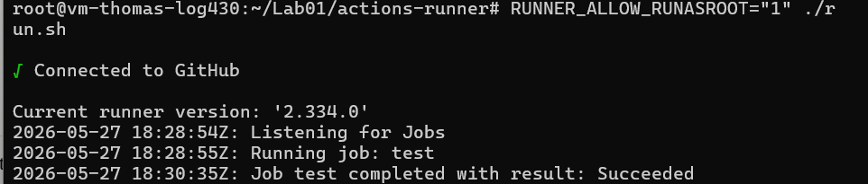

# Rapport – Lab 01 Log430
**Thomas Journault**

---

## Question 1 – Opérations UPDATE et DELETE dans MySQL

Oui, du SQL est utilisé via Python. `mysql-connector-python` permet d'envoyer des requêtes SQL à MySQL depuis Python.

**UPDATE** — modifie le `name` et `email` d'un utilisateur identifié par son `id` :

```python
self.cursor.execute(
    "UPDATE users SET name = %s, email = %s WHERE id = %s",
    (user.name, user.email, user.id)
)
self.conn.commit()
```

**DELETE** — supprime la ligne dont l'`id` correspond :

```python
self.cursor.execute(
    "DELETE FROM users WHERE id = %s",
    (user_id,)
)
self.conn.commit()
```

Les `%s` sont des paramètres liés (parameterized queries) : MySQL injecte les valeurs de façon sécurisée, ce qui évite les injections SQL. Le `commit()` est obligatoire pour persister les changements sur les opérations (`INSERT`, `UPDATE`, `DELETE`).

---

## Question 2 – Opérations dans MongoDB

Non, MongoDB n'utilise pas de SQL, mais du noSQL. pymongo utilise une API Python orientée documents. il est stocké sous la forme de Json.

**Différence clé avec MySQL :** MongoDB identifie les documents par `_id` de type `ObjectId` (généré automatiquement), non par un entier auto-incrémenté. 

**select_all** — récupère tous les documents de la collection :

```python
self.collection.find()
# → renvoie un curseur de documents dict
```

**insert** — insère un document et retourne l'`_id` généré (ObjectId) :

```python
result = self.collection.insert_one({"name": user.name, "email": user.email})
return result.inserted_id
```

**update** — met à jour les champs avec l'opérateur `$set` :

```python
self.collection.update_one(
    {"_id": user.id},
    {"$set": {"name": user.name, "email": user.email}}
)
```

**delete** — supprime le document par son `_id` :

```python
self.collection.delete_one({"_id": user_id})
```


---

## Question 3 – Implémentation de product_view.py

`product_view.py` n'importe **pas** directement `ProductDAO`. Il passe par `ProductController`, conformément au patron MVC : la Vue ne connaît que le Contrôleur, et le Contrôleur connaît la DAO(Model).

```python
from models.product import Product
from controllers.product_controller import ProductController

class ProductView:
    @staticmethod
    def show_options():
        controller = ProductController()
        while True:
            print("\n1. Montrer la liste d'items\n2. Ajouter un item\n3. Supprimer un item\n4. Retour")
            choice = input("Choisissez une option: ")

            if choice == '1':
                products = controller.list_products()
                ProductView.show_products(products)
            elif choice == '2':
                name, brand, price = ProductView.get_inputs()
                product = Product(None, name, brand, price)
                controller.create_product(product)
            elif choice == '3':
                product_id = input("ID du produit à supprimer : ").strip()
                controller.remove_product(int(product_id))
            elif choice == '4':
                controller.shutdown()
                break
            else:
                print("Cette option n'existe pas.")
```

Cette séparation respecte le principe de responsabilité unique : la Vue gère uniquement l'affichage et la saisie, le Contrôleur S'occupe de la logique, et la DAO donne l'accès aux données. Si on remplace `ProductDAO` par une autre implémentation (ex. MongoDB), seul le Contrôleur et la DAO changent,tandis que la Vue reste intacte.

---

## Question 4 – Associer des achats (Users → Products)

### Dans MySQL (relationnel)

On crée une table de jonction `purchases` avec des clés étrangères vers `users` et `products` :

```sql
CREATE TABLE purchases (
    id INT AUTO_INCREMENT PRIMARY KEY,
    user_id INT NOT NULL,
    product_id INT NOT NULL,
    quantity INT NOT NULL DEFAULT 1,
    purchased_at DATETIME DEFAULT CURRENT_TIMESTAMP,
    FOREIGN KEY (user_id) REFERENCES users(id),
    FOREIGN KEY (product_id) REFERENCES products(id)
);
```

Les données restent **normalisées** : chaque entité est dans sa propre table, les relations sont exprimées par des clés étrangères, et on utilise des `JOIN` pour reconstituer les associations.

### Dans MongoDB (documents)

Deux approches sont possibles :

```json
{
  "_id": ObjectId("..."),
  "name": "Ada Lovelace",
  "purchases": [
    { "product_name": "Laptop", "brand": "Dell", "price": 1999.99, "quantity": 1 },
    { "product_name": "Mouse", "brand": "Razer", "price": 129.99, "quantity": 1 }
  ]
}
```
```json
{
  "_id": ObjectId("..."),
  "name": "Ada Lovelace",
  "purchases": [
    { "product_id": ObjectId("..."), "quantity": 5 }
  ]
}
```
Soit on stock le produit directement dans les document de l'utilisateur, ou on stock la référence à l'objet dans celui-ci via son `_id` qui est une approche qui a plus de similarité avec les clé étrangère de SQL


# Annexe 

## Annexe - CI sur la VM



## Annexe - Résultat des tests


